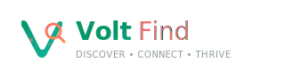

# VoltFind Brand Assets



## 🎨 Logo Design Concept

VoltFind's logo combines the power of the "Volt" brand family with the discovery essence of "Find". The design features:

- **Stylized V**: Represents the Volt brand and suggests energy/lightning
- **Integrated Search**: Magnifying glass symbolizes finding and discovery
- **African Warmth**: Coral accents and rounded shapes create approachability
- **Futuristic Feel**: Gradients and clean lines suggest innovation
- **Universal Appeal**: Works across cultures and languages

## 📁 File Structure

```
brand/
├── logo-full.svg           # Primary horizontal logo
├── logo-full-dark.svg      # Dark background variant
├── logo-icon.svg          # Icon only (square)
├── logo-mono-white.svg    # White monochrome
├── logo-mono-black.svg    # Black monochrome
├── logo-icon-512.png      # PWA icon (512×512)
├── logo-icon-192.png      # PWA icon (192×192)
├── favicon-32.png         # Favicon (32×32)
├── favicon-16.png         # Favicon (16×16)
├── BRAND-GUIDE.md         # Complete brand guidelines
├── logo-preview.html      # Visual preview of all variants
├── generate-png.js        # PNG generation script
├── package.json           # Dependencies and scripts
└── README.md              # This file
```

## 🚀 Quick Start

### View Logo Preview
Open `logo-preview.html` in a browser to see all logo variations and usage examples.

### Generate PNGs
```bash
# Install dependencies
npm install

# Generate PNG files from SVGs
npm run generate

# Or run directly
node generate-png.js
```

### Start Preview Server
```bash
npm run preview
# Then visit http://localhost:8080/logo-preview.html
```

## 🎯 Usage Guidelines

### Minimum Sizes
- **Full Logo**: 120px width minimum
- **Icon**: 16px minimum (favicons)
- **Clear Space**: Equal to V height on all sides

### Background Usage
- **Light backgrounds**: Use `logo-full.svg`
- **Dark backgrounds**: Use `logo-full-dark.svg`
- **Single color**: Use monochrome versions

### Colors
- **Primary**: Emerald `#059669`
- **Secondary**: Coral `#FF6B6B`
- **Gradients**: Built into SVG files

## 🔧 Technical Details

- **Format**: SVG (vector) + PNG (raster) exports
- **Dependencies**: Sharp (Node.js image processing)
- **Compatibility**: All modern browsers and devices
- **Optimization**: Production-ready, minified SVGs

## 📱 PWA Integration

The PNG files are sized specifically for Progressive Web App requirements:

```json
{
  "icons": [
    {
      "src": "/brand/logo-icon-192.png",
      "sizes": "192x192",
      "type": "image/png"
    },
    {
      "src": "/brand/logo-icon-512.png", 
      "sizes": "512x512",
      "type": "image/png"
    }
  ]
}
```

## 🌍 Brand Context

VoltFind is part of the Volt ecosystem serving African markets:

- **VoltRide**: Transportation solutions
- **VoltPay**: Payment platform  
- **VoltGrid**: Energy infrastructure
- **VoltFind**: Marketplace platform

The logo maintains family consistency while establishing VoltFind's unique identity as the discovery platform.

---

**Created**: February 2026  
**Version**: 1.0.0  
**Status**: Production Ready ✅